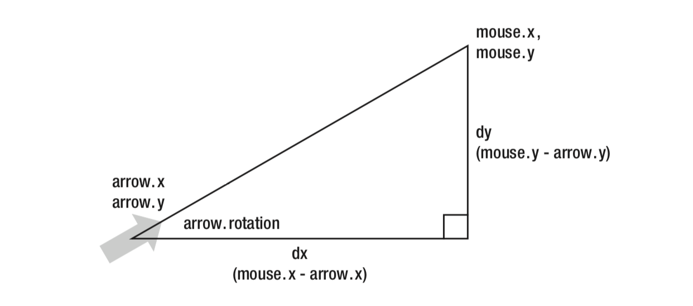

# 动画的三角学

## 三角函数

- Sine: Math.sin(radian)
- Cosine: Math.cos(radian)
- Tangent: Math.tan(radian)
- Arcsine: Math.asin(ratio)
- Arcconsine: Math.acos(ratio)
- Arctangent: Math.atan(ratio) Math.atan2(x, y)

### 计算旋转角度



```js
const rotation = Math.atan2(dy, dx); // 弧度值
```