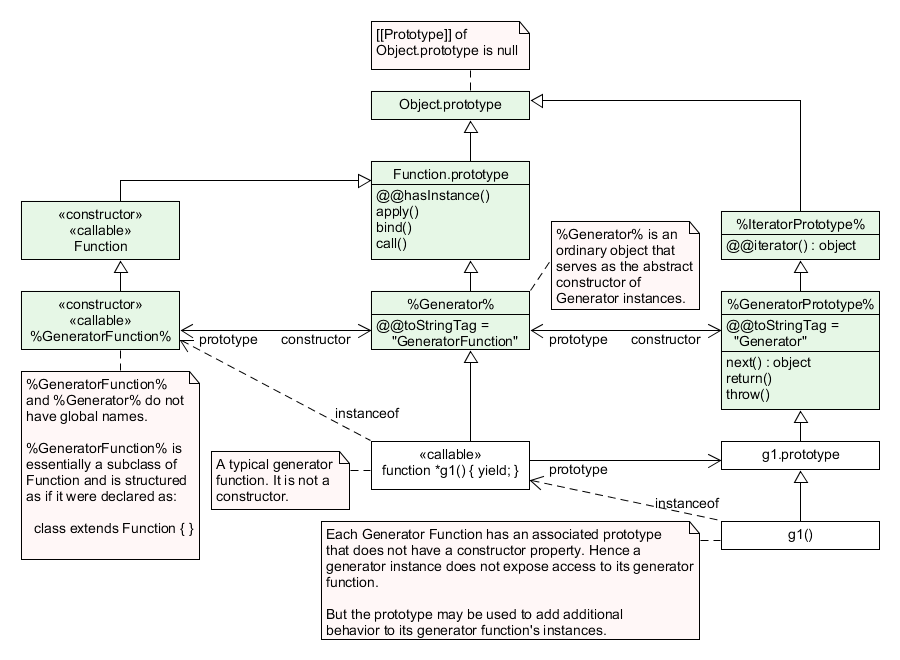

# 25 控制抽象对象

## 25.1 迭代

### 25.1.1 通用迭代接口

接口是一组属性键，其关联值与特定规范匹配。提供接口规范描述的所有属性的任何对象都符合该接口。接口不由不同的对象表示。可能有许多单独实现的对象符合任何接口。单个对象可以符合多个接口。

#### 25.1.1.1 Iterable接口

| 属性 | 值 | 要求 |
| @@iterator | 返回Iterator对象的函数 | 返回的对象必须符合Iterator接口。|

#### 25.1.1.2 Iterator接口

实现Iterator的对象必须有下表的属性。实现Iterator接口的对象必须包含表61中的属性。此类对象还可以实现表62中的属性。

| 属性 | 值 | 要求 |
| next | 返回iteratorResult对象的函数 | 返回的对象必须符合IteratorResult接口。如果先前对Iterator的下一个方法的调用返回了其done属性为true的IteratorResult对象，则对该对象的下一个方法的所有后续调用也应返回其done属性为true的IteratorResult对象。但是，此要求未得到强制执行。 |

> 参数可以传递给下一个函数，但它们的解释和有效性取决于目标迭代器。 for-of语句和迭代器的其他常见用户不传递任何参数，因此期望以这种方式使用的Iterator对象必须准备好处理没有参数的调用

| 属性 | 值 | 要求 |
| return | 返回iteratorResult对象的函数 | 返回的对象必须符合IteratorResult接口。调用此方法会通知Iterator对象调用者不打算再对Iterator进行下一次方法调用。返回的IteratorResult对象通常具有一个值为true的done属性，以及一个value属性，其值作为return方法的参数传递。但是，此要求未得到强制执行。|
| throw | 返回iteratorResult对象的函数 | 返回的对象必须符合IteratorResult接口。调用此方法会通知Iterator对象调用方已检测到错误情况。该参数可用于识别错误条件，并且通常是异常对象。典型的响应是抛出作为参数传递的值。如果方法不抛出，则返回的IteratorResult对象通常具有值为true的done属性。
 |

 > 通常这些方法的调用者应该在调用它们之前检查它们的存在。某些ECMAScript语言功能（包括for-of，yield *和数组解构）在执行存在检查后调用这些方法。大多数接受Iterable对象作为参数的ECMAScript库函数也有条件地调用它们。

 #### 25.1.1.3 AsyncIterable接口

 | 属性 | 值 | 要求 |
 | @@asyncIterator | 返回AsyncIterator对象 | 返回的对象必须符合AsyncIterator接口 |

#### 25.1.1.4 AsyncIterator接口

| 属性 | 值 | 要求 |
| next | 返回IteratorResult promise的函数 | 返回的pormise在fulfilled状态是，返回的对象必须满足Iterator接口。 |

#### 25.1.1.5 IteratorResult对象

| 属性 | 值 | 要求 |
| done | true或false | 是iterator next方法调用的结果状态。如果是true代表这迭代的结束。如果没到结束，done是false, value存在。如果done不存在则认为是false |
| value | 任何ECMAScript语言值 | 如果done是false, 就是当前迭代元素的值， |

### 25.1.2 IteratorPrototype对象

#### 25.1.2.1 IteratorPrototype[@@iterator]()

## 25.2 GeneratoreFunction Objects

GeneratorFunction对象是通常通过评估GeneratorDeclarations，GeneratorExpressions和GeneratorMethods创建的函数。它们也可以通过调用％GeneratorFunction％内在函数来创建。

### 25.2.1 GeneratorFunction构造函数

- 是固有对象%GeneratorFunction%
- 作为普通函数调用时创建并生成一个新的构造函数对象。使用new GeneratorFunction(...)效果是一样的
- 可自类化

### 25.2.1.1 GeneratorFunction(p1, p2, ..., pn, body)

最后一个参数指定生成器函数的主体（可执行代码）;任何前面的参数指定形式参数。

当使用一些参数p1，p2，...，pn，body（其中n可能为0，即没有“p”参数，并且也可能未提供body）调用GeneratorFunction函数时，以下步骤为采取：

1. 设C为活跃函数对象
2. 设args为通过[[Call]]和[[Construct]]传递的argumentList
3. 返回CreateDynamicFunction(C, NewTarget, "generator", args)

### 25.2.2 GeneratorFunction构造函数的属性

#### 25.2.2.1 GeneratorFunction.length

#### 25.2.2.2 GeneratorFunction.prototype

### 25.2.3 GeneratorFunction原型对象的属性

### 25.2.4 GeneratorFunction 实例

## 25.3 AsyncGeneratorFunction对象

## 25.4 Generator对象

Generator对象是生成器函数的实例，并且符合Iterator和Iterable接口。 Generator实例直接从对象继承属性，该属性是创建实例的Generator函数的prototype属性的值。 Generator实例间接地从Generator Prototype内在函数％GeneratorPrototype％继承属性。

### 25.4.1 Generator原型对象

- 是固有对象%GeneratorPrototype%
- 是固有对象%Generator%的prototype属性的初始值
- 是个普通对象
- 不是Generator实例，没有[[GeneratorState]]内部插槽
- 有[[prototype]]内部插槽，值为固有对象IteratorPrototype
- 有直接继承Generator实例的所有属性

#### 25.4.1.1 Generator.prototype.constructor

#### 25.4.1.2 Generator.prototype.next(value)

1. 设g为this值
2. 返回GeneratorResume(g, value)

#### 25.4.1.3 Generator.prototype.return(value)

1. 设g为this值
2. 设C为Completion{[[Type]]: return, [[Value]]: value, [[Target]]: empty}
3. 返回GeneratorResumeAbrupt(g, C)

#### 25.4.1.5 Generator.prototype[@@toStringTag]

## 25.5 AsyncGenerator对象

## 25.6 Promise对象

Promise是一个对象，用作占位符，用于延迟（可能是异步）计算的最终结果。

任何Promise对象都处于三种互斥状态之一：fulfilled，rejected和pending：

- promise p 处于fulfilled状态，如果p.then(f, r)立刻将函数f加入事件队列
- promise p 处于rejected状态，如果p.then(f, r)立刻将r加入事件队列
- promise既不是fulfilled也不是rejected时，就是pending状态

如果一项承诺没有待决，即如果它已被履行或被拒绝，则该承诺将被settled。

如果一个承诺被解决或者它被“锁定”以匹配另一个承诺的状态，则该承诺得到解决。尝试解决或拒绝已解决的承诺无效。如果未解决，则承诺未得到解决。未解决的承诺始终处于暂挂状态。已解决的承诺可能正在等待，履行或拒绝。

### 25.6.1 Promise抽象操作

#### 25.6.1.1 PromiseCapability记录

PromiseCapability是一个Record值，用于封装promise对象以及能够解析或拒绝该promise对象的函数。PromiseCapability记录由NewPromiseCapability抽象操作生成。

| 字段名 | 值 | 含义 |
| [[Promise]] | 对象 | 可以当多promise使用的对象 |
| [[Resolve]] | 一个函数对象 | resolve promise对象的函数 |
| [[Reject]] | 一个函数对象 | reject promise对象的函数 |

##### 25.6.1.1.1 IfAbruptRejectPromise(value, capability)

IfAbruptRejectPromise是使用PromiseCapability Record的一系列算法步骤的简写

1. 如果value是arbupt completion
    - 执行Call(capability.[[Reject]], undefined, <<value.[[Value]]>>)
    - 返回capability.[[Promise]]
2. 如果value是Completion Record, 设value为value.[[Value]]

#### 25.6.1.2 PromiseReaction记录

PromiseReaction是一个Record值，用于存储有关promise在使用给定值解析或拒绝时应如何反应的信息。

| 字段名 | 值 | 含义 |
| [[Capability]] | PromiseCapabilityRecord或者undefined | 承诺的能力，此记录提供反应处理程序 |
| [[Type]] | 'Fulfill'或者'Reject' | 未定义[[Handler]]时使用[[Type]]以允许特定于结算类型的行为。 |
| [[Handler]] | 函数对象或者undefined | 应该应用于传入值的函数，其返回值将控制派生的promise所发生的情况。如果[[Handler]]未定义，则将使用取决于[[Type]]值的函数。 |

#### 25.6.1.3 CreateResolvingFunctions(promise)

1. 设alreadyResolved为新的Record { [[Value]]: false }
2. 设stepsResolve为Promise Resolve Functions中定义的算法步骤
3. 设resolve为CreateBuiltinFunction(stepsResolve, <<[[Promise]]>>, [[AlreadyResolved]])
4. 设resolve.[[Promise]]为promise
5. 设resolve.[[AlreadyResolved]]为alreadyResolved
6. 设stepReject为Promise Reject Functions中定义的算法步骤
7. 设reject为CreateBuiltinFunction(stepsReject, <<[[Promise]]>>, [[AlreadyResolved]])
8. 设reject.[[Promise]]为promise
9. 设reject.[[AlreadyResolved]]为alreadyResolved
10. 返回新的记录{[[Resolve]]: resolve, [[Reject]]: reject}

### 25.6.3 Promise构造函数

- 是固有对象Promise
- 是全局对象的Promise属性的初始值
- 当做构造函数调用时会创建并初始化一个新的Promise对象
- 不能被当做普通函数调用
- 可子类化。

#### 25.6.3.1 Promise(executor)

1. 如果New Target是undefined，抛出类型错误异常
2. 如果IsCallable(executor)为false, 抛出类型错误异常
3. 设promise为OrdinaryCreateFromConstructor(NewTarget, "%PromisePrototype%", <<[[PromiseState]], [[PromiseResult]], [[PromiseFulfillReactions]], [[PromiseRejectReactions]], [[PromiseIsHandled]]>>)
4. 设promise.[[PromiseState]]为"pending"
5. 设promise.[[PromiseFulfillReactions]]为新的空List
6. 设promise.[[PromiseRejectReactions]]为新的空列表
7. 设promise.[[PromiseIsHandled]]为false
8. 设resolvingFunctions为CreateResolvingFunctions(promise)
9. 设completion为Call(executor, undefined, <<resolvingFunctions.[[Resolve]], resolvingFunctions.[[Reject]]>>)
10. 如果completion是abrupt completion
    - Call(resolvingFunctions.[[Reject]], undefined, <<completion.[[Value]]>>)
11. 返回promise

### 25.6.4 Promise构造函数的属性

#### 25.6.4.1 Promise.all(iterable)

all函数返回一个新的promise，它通过传递的promise的一系列履行值来实现，或者拒绝第一个传递的拒绝承诺的原因。它在运行此算法时将传递的iterable的所有元素解析为promises

1. 设C为this值
2. 如果C的类型不是对象，抛出类型错误异常
3. 设promiseCapability为NewPromiseCapability(C)
4. 设iteratorRecord为GetIterator(iterable)
5. IfAbruptRejectPromise(iteratorRecord, promiseCapability)
6. 设result为PerformPromiseAll(iteratorRecord, C, promiseCapability)
7. 如果result是abrupt completion
    - 如果iteratorRecord.[[Done]]为false, 设result为IteratorClose(iteratorRecord, result)
    - IfAbruptRejectPromise(result, promiseCapability)
8. 返回Completion(result)

#### 25.6.4.2 Promise.prototype

#### 25.6.4.3 Promise.race()

#### 25.6.4.4 Promise.reject()

#### 25.6.4.5 Promise.resolve()

#### 25.6.4.6 get Promise[@@species]

### 25.6.5 Promise原型对象属性

#### 25.6.5.1 Promise.prototype.catch(onRejected)

#### 25.6.5.2 Promise.prototype.constructor

#### 25.6.5.3 Promise.prototype.finally(onFinally)

#### 25.6.5.4 Promise.prototype.then(onFulfilled, onRejected)