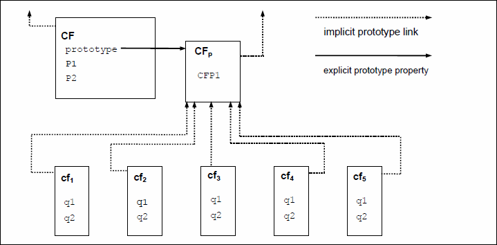

## 概览

本节包含ECMAScript语言的非规范性概述。

ECMAScript是一种面向对象的编程语言，用于在主机环境中执行计算和操作计算对象。这里定义的ECMAScript不是计算上自给自足的;实际上，在本说明书中没有规定输入外部数据或输出计算结果。相反，期望ECMAScript程序的计算环境不仅将提供本说明书中描述的对象和其他设施，而且还提供某些特定于环境的对象，其描述和行为超出了本规范的范围，除了表明它们可以提供可以访问的某些属性以及可以从ECMAScript程序调用的某些功能。

ECMAScript最初设计用作脚本语言，但已广泛用作通用编程语言。脚本语言是一种编程语言，用于操作，定制和自动化现有系统的功能。在这样的系统中，有用的功能已经通过用户界面可用，并且脚本语言是用于将该功能暴露给程序控制的机制。以这种方式，据说现有系统提供对象和设施的主机环境，这完成了脚本语言的功能。脚本语言旨在供专业和非专业程序员使用。

ECMAScript最初设计为Web脚本语言，提供了一种机制，可以使浏览器中的Web页面活跃起来，并作为基于Web的客户端 - 服务器体系结构的一部分执行服务器计算。 ECMAScript现在用于为各种主机环境提供核心脚本编写功能。因此，除了任何特定的主机环境之外，本文档中还指定了核心语言。

ECMAScript的使用已经超越了简单的脚本，它现在可用于许多不同环境和规模的全方位编程任务。随着ECMAScript的使用范围的扩大，它提供的功能和设施也在不断扩展。 ECMAScript现在是一种功能齐全的通用编程语言。

ECMAScript的一些功能类似于其他编程语言中使用的功能;特别是C，Java™，Self和Scheme，如下所述：

ISO/IEC 9899:1996, *Programming Languages – C*.

Gosling, James, Bill Joy and Guy Steele. *The Java™ Language Specification. Addison Wesley Publishing Co., 1996*.

Ungar, David, and Smith, Randall B. Self: *The Power of Simplicity. OOPSLA '87 Conference Proceedings*, pp. 227-241, Orlando, FL, October 1987.

*IEEE Standard for the Scheme Programming Language*. IEEE Std 1178-1990.

### 4.1 Web脚本

Web浏览器为客户端计算提供ECMAScript主机环境，包括例如表示窗口，菜单，弹出窗口，对话框，文本区域，锚点，框架，历史，cookie和输入/输出的对象。此外，主机环境提供了一种将脚本代码附加到事件的方法，例如焦点变化，页面和图像加载，卸载，错误和中止，选择，表单提交和鼠标操作。脚本代码出现在HTML中，显示的页面是用户界面元素和固定和计算的文本和图像的组合。脚本代码对用户交互起反应，不需要主程序。

Web服务器为服务器端计算提供不同的主机环境，包括表示请求，客户端和文件的对象;以及锁定和共享数据的机制。通过一起使用浏览器端和服务器端脚本，可以在客户端和服务器之间分配计算，同时为基于Web的应用程序提供自定义用户界面。

每个支持ECMAScript的Web浏览器和服务器都提供自己的主机环境，完成ECMAScript执行环境。

### 4.2 ECMAScript 概览、

以下是ECMAScript的非正式概述 - 并未描述该语言的所有部分。此概述不是标准的一部分。

ECMAScript是基于对象的：基础语言和主机设施由对象提供，ECMAScript程序是通信对象的集群。在ECMAScript中，对象是零个或多个属性的集合，每个属性都具有确定如何使用每个属性的属性 - 例如，当属性的Writable属性设置为false时，执行ECMAScript代码的任何尝试都会分配不同的属性财产的价值失败。属性是容纳其他对象，原始值或函数的容器。原始值(`primitive values`)是以下内置类型之一的成员：`Undefined`，`Null`，`Boolean`，`Number`，`String`和`Symbol`;对象是内置类型`Object`的成员;并且函数是可调用对象。通过属性与对象关联的函数称为方法(`method`)。

ECMAScript定义了一个内置对象的集合，它们完善了ECMAScript实体的定义。这些内置对象包括全局对象;对语言的运行时语义至关重要的对象，包括`Object`，`Function`，`Boolean`，`Symbol`和各种`Error`对象;表示和操作数值的对象，包括`Math`, `Number`和`Date`;文本处理对象`String`和`RegExp`;作为索引的值集合的对象，包括`Array`和九种不同类型的`Typed Arrays`，其元素都具有特定的数字数据表示;键控集合，包括`Map`和`Set`对象;支持结构化数据的对象，包括`JSON`对象，`ArrayBuffer`，`SharedArrayBuffer`和`DataView`;支持控件抽象的对象，包括生成器函数(`generator functions`)和`Promise`对象;和反射对象，包括代理(`Proxy`)和反射(`Reflect`)。

ECMAScript还定义了一组内置运算符。 ECMAScript运算符包括各种一元运算，乘法运算符，加法运算符，按位移位运算符，关系运算符，等式运算符，二进制位运算符，二元逻辑运算符，赋值运算符和逗号运算符。

大型ECMAScript程序由模块支持，这些模块允许将程序划分为多个语句和声明序列。每个模块都明确标识它使用的声明，这些声明需要由其他模块提供，其中哪些声明可供其他模块使用。

ECMAScript语法有意类似于Java语法。放宽ECMAScript语法，使其成为易于使用的脚本语言。例如，变量不需要声明其类型，也不需要与属性相关联的类型，并且定义的函数不需要在调用它们之前使其声明以文本方式显示。

#### 4.2.1 对象

尽管ECMAScript包含类定义的语法，但ECMAScript对象基本上不是基于类的，例如C++，Smalltalk或Java中的对象。相反，可以通过各种方式创建对象，包括通过字面量或通过构造器创建对象，然后执行通过为其属性分配初始值来初始化全部或部分的代码。每个构造函数都是一个函数，它具有一个名为`prototype`的属性，用于实现基于原型的继承和共享属性。通过在新表达式中使用构造函数来创建对象;例如，`new Date（2009,11）`创建一个新的Date对象。在不使用`new`的情况下调用构造函数会产生依赖于构造函数的后果。例如，`Date（）`生成当前日期和时间的字符串表示，而不是对象。

构造函数创建的每个对象都有一个隐式引用（称为对象的原型）到其构造函数的`prototype`属性的值。此外，原型可能具有对其原型的非null隐式引用，依此类推;这被称为原型链。当引用对象中的属性时，该引用是原型链中包含该名称属性的第一个对象中该名称的属性。换句话说，首先检查直接提到的对象的这种属性;如果该对象包含命名属性，那么该引用引用的属性;如果该对象不包含命名属性，则接下来检查该对象的原型;等等。

  

对象原型关系图

在基于类的面向对象语言中，通常，状态由实例承载，方法由类承载，而继承仅由结构和行为承载。在ECMAScript中，状态和方法由对象承载，而结构，行为和状态都是继承的。

所有不直接包含其原型包含的特定属性的对象共享该属性及其值。

CF是一个构造函数（也是一个对象）。通过`new`表达式创建了5个对象: `cf1`, `cf2`, `cf3`, `cf4`, `cf5`。每个对象都有`q1`和`q2`两个属性。虚线代表隐含的原型关系。比如，`cf3`的原型是CFp.构造函数`CF`本身有两个属性，`p1`和`p2`，对`CFp`，`cf1`, `cf2`, `cf3`, `cf4`, `cf5` 是不可见的。`CFp`的属性CFP1被`cf1`, `cf2`, `cf3`, `cf4`, `cf5`共享，但是不包括`CF`，其他所有在`CFp`隐式原型链上的所有属性也是一样的。请注意，`CF`和`CFp`之间没有隐式原型链接。

与大多数基于类的对象语言不同，可以通过为对象赋值来动态地将属性添加到对象。也就是说，构造函数不需要为所有或任何构造对象的属性命名或赋值。在上图中，可以通过为`CFp`中的属性分配新值，为`cf1`，`cf2`，`cf3`，`cf4`和`cf5`添加新的共享属性。

虽然ECMAScript对象本质上不是基于类的，但基于构造函数，原型对象和方法的常见模式来定义类类抽象通常很方便。 ECMAScript内置对象本身遵循类似类的模式。从ECMAScript 2015开始，ECMAScript语言包括语法类定义，允许程序员简明地定义符合内置对象使用的类似类抽象模式的对象。

#### 4.2.2 ECMAScript的严格变体

ECMAScript语言识别该语言的某些用户可能希望限制他们使用该语言中可用的某些功能的可能性。为了安全起见，他们可能会这样做，以避免他们认为容易出错的功能，获得增强的错误检查，或者出于他们选择的其他原因。为了支持这种可能性，ECMAScript定义了该语言的严格变体。该语言的严格变体排除了常规ECMAScript语言的一些特定语法和语义特征，并修改了某些特征的详细语义。严格变量还指定了必须通过在非严格形式的语言未指定为错误的情况下抛出错误异常来报告的其他错误条件。

ECMAScript的严格变体通常被称为语言的严格模式。严格模式选择和ECMAScript的严格模式语法和语义的使用是在单个ECMAScript源文本单元的级别上明确进行的。因为在语法源文本单元的级别选择严格模式，所以严格模式仅在这样的源文本单元中施加具有局部效果的限制。严格模式不限制或修改ECMAScript语义的任何方面，这些方面必须在多个源文本单元中一致地运行。完整的ECMAScript程序可以由严格模式和非严格模式ECMAScript源文本单元组成。在这种情况下，严格模式仅适用于实际执行在严格模式源文本单元中定义的代码。

为了符合此规范，ECMAScript实现必须实现完全不受限制的ECMAScript语言和本规范定义的ECMAScript语言的严格变体。此外，实现必须支持将无限制和严格模式源文本单元组合到单个复合程序中。

### 4.3 术语和定义

出于本文档的目的，以下术语和定义适用。

#### 4.3.1 类型

本规范第6节中定义的数据值集

#### 4.3.2 原始值

第6节中定义的`Undefined`，`Null`，`Boolean`，`Number`，`Symbol`或`String`类型之一的成员  
> 原始值是直接在语言实现的最低级别表示的数据。

#### 4.3.3 对象

Object类型的成员  
> 对象是属性的集合，并且具有单个原型对象。原型可以是空值。

#### 4.3.4 构造函数

创造和初始化对象的函数对象  
> 构造函数的prototype属性的值是一个原型对象，用于实现继承和共享属性。

#### 4.3.5 原型

为其他对象提供共享属性的对象  
> 当构造函数创建一个对象，这个对象隐式引用构造函数的原型对象属性已解析属性引用。构造函数的prototype属性可以由程序表达式`constructor.prototype`引用，添加到对象原型的属性通过继承共享原型的所有对象共享。或者，可以使用`Object.create`内置函数使用显式指定的原型创建新对象。

#### 4.3.6 普通对象

具有所有对象必须支持的基本内部方法的默认行为的对象

#### 4.3.7 奇异的对象(exotic object)

对于一个或多个基本内部方法没有默认行为的对象

#### 4.3.8 标准对象

对象，其语义由本规范定义

#### 4.3.9 內建对象

由ECMAScript实现指定和提供的对象  
> 本规范中定义了标准内置对象。 ECMAScript实现可以指定和提供其他类型的内置对象。内置构造函数是一个内置对象，也是一个构造函数。

#### 4.3.10 undefined

未赋值变量时使用的原始值

#### 4.3.11 Undefined 类型

唯一值为undefined的类型

#### 4.3.12 null值

原始值，表示故意缺少任何对象值

#### 4.3.13 Null类型

唯一值为`null`值的类型

#### 4.3.14 布尔值

布尔类型的成员  
> 只有两种布尔值，`true`和`false`

#### 4.3.15 布尔类型

由原始值`true`和`false`组成的类型

#### 4.3.16 布尔对象

`Object`类型的成员，它是标准内置布尔构造函数的实例  
> 通过在新表达式中使用布尔构造函数创建布尔对象，并将布尔值作为参数提供。生成的对象有一个内部插槽，其值为布尔值。可以将布尔对象强制转换为布尔值。

#### 4.3.17 字符串值

原始值，它是零个或多个16位无符号整数值的有限有序序列  
> `String`值是`String`类型的成员。序列中的每个整数值通常表示单个16位UTF-16文本单元。但是，ECMAScript不对值赋予任何限制或要求，除非它们必须是16位无符号整数。

#### 4.3.18 字符串类型

所有可能的字符串值的集合

#### 4.3.19 字符串对象

`Object`类型的成员，它是标准内置`String`构造函数的实例  
> 通过在新表达式中使用`String`构造函数创建String对象，并将`String`值作为参数提供。生成的对象有一个内部插槽，其值为`String`值。通过将`String`构造函数作为函数（21.1.1.1）调用，可以将`String`对象强制转换为`String`值。

#### 4.3.20 数字值

原始值对应于双精度64位二进制格式IEEE 754-2008值  
> Number值是Number类型的成员，是数字的直接表示。

#### 4.3.21 数字类型

所有可能的数值的集合，包括特殊的“非数字”（NaN）值，正无穷大和负无穷大

#### 4.3.22 数字对象

`Object`类型的成员，它是标准内置`Number`构造函数的实例  
> 通过在`new`表达式中使用`Number`构造函数创建`Number`对象，并提供数值作为参数。生成的对象有一个内部插槽，其值为数值。通过将Number构造函数作为函数（20.1.1.1）调用，可以将`Number`对象强制转换为数字值。

#### 4.3.23 无穷

数值，即正无限数值

#### 4.3.24 NaN

不是`Number`的`Number`

#### 4.3.25 符号

原始值，表示唯一的非`String`对象属性键

#### 4.3.26 符号类型

所有可能的符号值的集合

#### 4.3.27 符号对象

`Object`类型的成员，它是标准内置`Symbol`构造函数的实例

#### 4.3.28 函数

可以作为子例程调用的`Object`类型的成员  
> 除了其属性之外，函数还包含可执行代码和状态，用于确定调用时的行为方式。函数的代码可能会也可能不会写入ECMAScript。

#### 4.3.29 內建函数

作为函数的内置对象  
> 内置函数的示例包括`parseInt`和`Math.exp`。实现可以提供在本说明书中未描述的依赖于实现的内置函数。

#### 4.3.30 属性(property)

将键（`String`值或`Symbol`值）与值相关联的对象的一部分  
> 根据属性的形式，值可以直接表示为数据值（原始值，对象或函数对象），也可以由一对存取器函数间接表示。

#### 4.3.31 方法

函数是属性的值  
> 当函数作为对象的方法调用时，该对象将作为`this`值传递给函数。

#### 4.3.32 內建方法

是內建函数的方法  
> 本规范中定义了标准内置方法，ECMAScript实现可以指定并提供其他附加内置方法。

#### 4.3.33 属性(attribute)

定义属性某些特征的内部值  

#### 4.3.34 自身属性

由其对象直接包含的属性

#### 4.3.35 继承属性

对象的属性不是自己的属性，而是对象原型的属性（自己的或继承的）

### 4.4 本规范的组织

本规范的其余部分组织如下：

第5节定义了整个说明书中使用的符号约定。

第6-9节定义了ECMAScript程序运行的执行环境。

第10-16节定义了实际的ECMAScript编程语言，包括其语法编码和所有语言特性的执行语义。

第17-26条定义了ECMAScript标准库。它们包括ECMAScript程序执行时可供其使用的所有标准对象的定义。

第27节描述了在SharedArrayBuffer支持的内存和Atomics对象的方法上访问的内存一致性模型。
